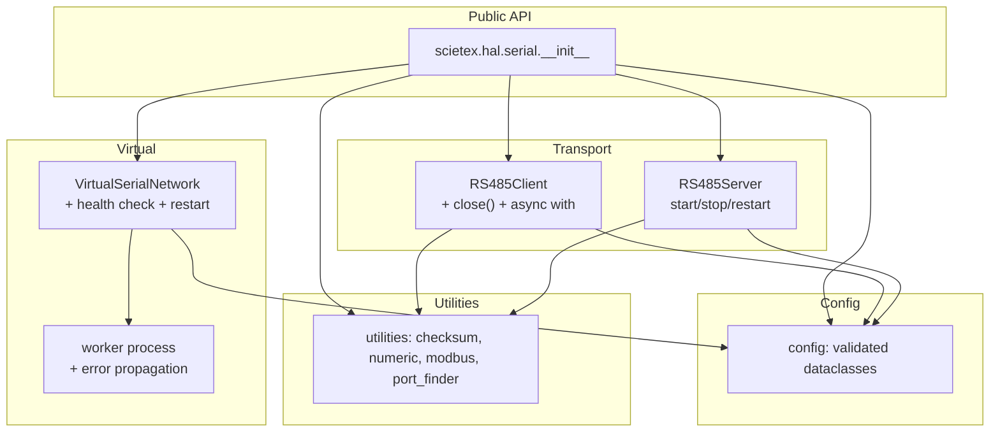

# Architecture Review — `scietex.hal.serial`

- **Review ID:** 2025-09-30-001
- **Date:** 2025-09-30
- **Version reviewed:** 1.3.0 (`src/scietex/hal/serial/version.py`)
- **Scope:** Entire repository — `src/`, `tests/`, `examples/`, packaging and CI configuration
- **Method:** Source-level reading of every module, cross-checked against the architecture map in `docs/architecture/` and the test suite. Findings are evidence-based; each cites concrete `file:line` locations.
- **Constraint honored:** No source or test files were modified. The only artifact produced is this document.

---

## Executive Summary

`scietex.hal.serial` is a compact, well-factored Python library for Modbus/RS485 serial communication with a genuinely useful virtual-serial test harness. The layering is clean: `config` (validated dataclasses) → `utilities` (protocol helpers) → `client`/`server` (pymodbus wrappers) → `virtual` (PTY-based simulation). The public API is small and coherent, and the test suite exercises real end-to-end communication over virtual ports rather than mocking the transport — a strong design choice.

The architecture is sound for its current scale. The issues found are not structural rot; they are **boundary and lifecycle gaps** that will bite as the library is used in long-running or multi-connection scenarios:

1. **Resource lifecycle is asymmetric.** `RS485Client` has no `close()`/`disconnect()` and no context-manager support, while `RS485Server` has full `start`/`stop`/`restart`. Clients are created per-operation in `utilities/modbus.py` and closed in a `finally`, but the `RS485Client` class itself leaks its underlying pymodbus client.
2. **The virtual-serial worker is a single point of failure with no supervision.** If the worker process dies, the parent has no health check and no restart path; `stop()` silently no-ops on a dead process.
3. **Packaging/CI is internally inconsistent** (missing `all` extra, tox vs. CI Python matrix, README version drift, `pythonpath` conflict). These are cheap to fix and currently make CI red.
4. **Error handling is inconsistent** — some paths return `None`, some raise, some swallow `CancelledError`; there is no library-level exception hierarchy beyond `SerialConnectionConfigError`.

None of these are CRITICAL in the sense of data loss or security. The library is a hardware-adjacent utility, not a trust boundary. The highest-value work is lifecycle symmetry (client close) and worker supervision, followed by packaging hygiene.

**Overall assessment: solid foundation, needs lifecycle and operational hardening before it is production-grade for long-running deployments.**

---

## Architecture Assessment

### Layering

```
config/          validated dataclasses (no I/O)
   │
utilities/       pure helpers: checksum, numeric, modbus wrappers, port finder, mocks
   │
client/  server/ pymodbus AsyncModbusSerialClient / ModbusSerialServer wrappers
   │
virtual/         PTY-based virtual serial network (multiprocessing worker)
```

Dependency direction is correct: lower layers never import upper layers. `config` is dependency-free (stdlib only). `utilities/modbus.py` depends on `config` and `pymodbus`. `client`/`server` depend on `config` + `utilities`. `virtual` depends only on `config` and stdlib. This is a clean DAG with no cycles.

### Module responsibilities

| Module | Responsibility | Assessment |
|---|---|---|
| `config/` | Connection parameter models + validation | Clean; validation is centralized and tested |
| `utilities/checksum.py` | CRC-16/Modbus, LRC | Correct, self-contained |
| `utilities/numeric.py` | 32-bit combine/split, byte order | Pure, tested |
| `utilities/modbus.py` | pymodbus client factory + read/write wrappers | Convenient but hides lifecycle |
| `utilities/serial_port_finder.py` | VID/PID port discovery | Thin, hardware-specific constants hardcoded |
| `utilities/mock.py` | `mock_openpty` test helper | Test-only code shipped in the package |
| `client/rs485_client.py` | Async Modbus client wrapper | Feature-rich; no lifecycle management |
| `server/rs485_server.py` | Async Modbus server wrapper | Full lifecycle; custom framer/decoder support |
| `server/modbus_datablock.py` | Reactive datablock with callbacks | Useful extension point |
| `virtual/` | PTY network in a subprocess | Works; supervision gaps |

### Public API surface

`src/scietex/hal/serial/__init__.py:13-23` exports 9 symbols: `__version__`, three config classes, two virtual classes, `RS485Client`, `RS485Server`, `ReactiveSequentialDataBlock`. This is a reasonable, minimal surface. Notably absent from the public API: the `utilities` helpers (`modbus_get_client`, `check_sum`, `lrc`, `find_serial_ports`), which are useful enough to warrant export or at least documentation.

### Concurrency model

- **Client/server:** `asyncio`-based, wrapping pymodbus async clients. `RS485Server` runs its serving loop in an `asyncio.Task` (`_task`), cancelled and awaited on `stop()`.
- **Virtual network:** a separate `multiprocessing.Process` running `worker.create_serial_network`, driven over a `Pipe` with a command protocol (`create`/`add`/`remove`/`stop`). The worker blocks SIGINT/SIGTERM so the parent owns shutdown.

This is a sensible split: async for I/O-bound Modbus, a process for the blocking PTY forwarding loop.

---

## Strengths

- **S1. Clean dependency DAG.** No cycles; lower layers are dependency-free. Verified across all `__init__.py` and module imports.
- **S2. Real end-to-end tests.** `tests/virtual/test_virtual_serial_network.py:164` and `tests/client/test_client.py:38` exercise actual byte transfer over PTYs, not mocks. This catches integration bugs unit tests miss.
- **S3. Centralized validation.** `config/validation.py` funnels every parameter through a single validator with a dedicated exception (`SerialConnectionConfigError`), and `tests/config/test_config_validation.py` covers the boundary cases thoroughly.
- **S4. Idempotent lifecycle guards.** `VirtualSerialNetwork.start()` guards against double-start (`__p is not None`), and `RS485Server.stop()` cancels+awaits its task. These are the right instincts.
- **S5. Extensibility hooks.** `RS485Server`/`RS485Client` accept `custom_framer`, `custom_decoder`, `custom_pdu`, `custom_response`, demonstrated end-to-end in `tests/server/test_custom_request.py`. This is a real differentiator over raw pymodbus.
- **S6. Reactive datablock.** `ReactiveSequentialDataBlock` supports callbacks on value change — a useful primitive for simulation and control loops.
- **S7. Dual-import test shim.** The `try: from src... except ModuleNotFoundError: from scietex...` pattern makes tests runnable both from the repo root and against an installed package. Pragmatic given the namespace layout.

---

## Critical Issues

*None.* No data-loss, security, or correctness defects of critical severity were found. The library is a local hardware utility with no network trust boundary and no persistent state.

---

## Major Issues

### AR-001 — `RS485Client` has no lifecycle management (no `close`/`disconnect`/context manager)

- **Severity:** HIGH
- **Evidence:** `src/scietex/hal/serial/client/rs485_client.py` — the class exposes `read_*`/`write_*`/`execute` methods but no `close()`, `disconnect()`, `__aenter__`, or `__aexit__`. Contrast with `RS485Server`, which has `start()`/`stop()`/`restart()` (`server/rs485_server.py`). The only place the underlying client is closed is `utilities/modbus.py` (`finally: client.close()` around per-operation connect/close).
- **Problem:** A user who constructs `RS485Client(config)` directly (as the examples do — `examples/modbus_client.py:23`) has no supported way to release the serial port. The underlying pymodbus `AsyncModbusSerialClient` holds an open file descriptor; without an explicit close, the port stays locked until GC or process exit. There is no `async with RS485Client(...)` idiom.
- **Why it matters:** Serial ports are exclusive resources. A leaked client blocks the next process from opening the same port, and in long-running services this accumulates. The asymmetry with `RS485Server` makes the API surprising.
- **Recommendation:** Add `async def close(self)` delegating to the underlying client, plus `__aenter__`/`__aexit__` for `async with`. Document that `utilities/modbus.py`'s per-operation pattern is the alternative for short-lived use. This is the single highest-value change.
- **Confidence:** HIGH

### AR-002 — Virtual-serial worker process has no supervision or health check

- **Severity:** HIGH
- **Evidence:** `src/scietex/hal/serial/virtual/virtual_serial_network.py` — `start()` spawns `__p` and stores it; `stop()` guards `if __p is not None`, sends `{"cmd":"stop"}`, joins with `timeout=5`, then nulls the handle. There is no `is_alive()` check between operations, no restart on unexpected death, and no propagation of worker failure to the parent. `worker.py:create_serial_network` runs the forwarding loop inside `with Selector() as selector, ExitStack() as stack:` — if the loop raises, the process exits and the parent is never notified.
- **Problem:** If the worker dies (unhandled exception, OOM, signal), the parent's `serial_ports` list still points at PTY paths that no longer forward data. Subsequent `add`/`remove`/`create` calls send commands into a dead pipe and either block or raise `BrokenPipeError`/`EOFError` with no recovery. `stop()` on a dead process silently succeeds, masking the failure.
- **Why it matters:** The virtual network is the primary test harness for the whole library. A silent worker death turns into flaky, hard-to-diagnose test failures — exactly the class of bug the harness exists to prevent.
- **Recommendation:** (a) Check `__p.is_alive()` before sending commands and raise a clear `VirtualSerialNetworkError` if dead; (b) wrap the worker loop so unexpected exceptions are sent back over the pipe as an error message before exit; (c) optionally expose a `restart()` that re-spawns and re-adds ports. At minimum, (a) converts a silent hang into an actionable error.
- **Confidence:** HIGH

### AR-003 — Packaging and CI are internally inconsistent; CI is currently red

- **Severity:** HIGH (operational)
- **Evidence:**
  - `.github/workflows/python-package.yml` / `pylint.yml` install `.[all,test]`, but `pyproject.toml:26-35` defines only `dev`, `test`, `lint` — **no `all` extra**. CI install fails.
  - `tox.ini` `env_list` targets `py314` only, while CI tests 3.10/3.12/3.14 and `requires-python = ">=3.10"` (`pyproject.toml:14`). README still says Python 3.9.
  - `pytest.ini` sets `pythonpath = .` and `addopts = --capture=no`, **overriding** `pyproject.toml`'s `[tool.pytest.ini_options] pythonpath = ["src"]`. Two sources of truth for import resolution.
- **Problem:** The declared support matrix, the tested matrix, and the documented matrix disagree. The missing `all` extra means CI cannot even install the package as written.
- **Why it matters:** Red CI erodes the signal that protects every other change. Version drift misleads users about compatibility.
- **Recommendation:** Add an `all` extra (or change CI to `.[dev,test,lint]`); align `tox.ini` `env_list` with the CI matrix (or document why only 3.14 is local); pick one `pythonpath` source and delete the other; update README to `>=3.10`.
- **Confidence:** HIGH

---

## Moderate Issues

### AR-004 — Inconsistent error-handling contract across the API

- **Severity:** MEDIUM
- **Evidence:** Read/write wrappers return `None` on failure (`utilities/modbus.py`; `client/rs485_client.py` write methods fall back to `read_register` when the response is falsy and `no_response_expected=False`). `RS485Server.stop()` swallows `CancelledError` (`server/rs485_server.py`). `config/validation.py` raises `SerialConnectionConfigError`. `check_lrc` returns `False` on malformed input (`utilities/checksum.py:109-115`).
- **Problem:** Callers cannot tell "operation failed" from "value is legitimately None/zero" without inspecting logs. The write-method fallback to `read_register` is particularly surprising: a failed write silently becomes a read.
- **Why it matters:** Silent fallbacks hide protocol errors in production. A caller checking `if result is None` cannot distinguish a timeout from an out-of-range read.
- **Recommendation:** Define and document a single failure contract. Introduce a library exception (e.g. `ModbusOperationError`) and expose it through an **opt-in** `raise_on_error: bool = False` parameter on the read/write wrappers and `RS485Client` methods, defaulting to today's `None`-returning behavior. Reserve `None` for "no data at this address". Make the write→read fallback opt-in (or remove it). Flip the default to `True` only in a future **major** release. An opt-in parameter is preferred over a deprecation warning because a `None` return cannot be warned on without either a sentinel wrapper or a log-and-swallow path — the latter being the very anti-pattern this finding flags.
- **Confidence:** MEDIUM

### AR-005 — `utilities/mock.py` ships test-only code in the production package

- **Severity:** MEDIUM
- **Evidence:** `src/scietex/hal/serial/utilities/mock.py` contains `mock_openpty`, used only by `tests/virtual/test_virtual_serial_network.py:229` and `tests/virtual/test_virtual_serial_pair.py:95`. It is not exported in `__all__` and not referenced by any `src/` module.
- **Problem:** Test scaffolding lives in the shipped package, inflating the public surface and coupling tests to a production path.
- **Why it matters:** Minor, but it blurs the src/test boundary and invites accidental production use.
- **Recommendation:** Move `mock_openpty` into `tests/` (e.g. `tests/utilities/mock.py`) or a `conftest` helper. If it must stay for external test consumers, document it as test-only.
- **Confidence:** HIGH

### AR-006 — `utilities/__init__.py` is empty; utilities are not part of the public API

- **Severity:** MEDIUM
- **Evidence:** `src/scietex/hal/serial/utilities/__init__.py` is 0 bytes. `modbus_get_client`, `check_sum`, `lrc`, `find_serial_ports`, `combine_32bit`, etc. are reachable only via deep module paths. The top-level `__init__.py` exports none of them.
- **Problem:** Useful, stable helpers are effectively private. Users must import `scietex.hal.serial.utilities.modbus`, which signals "internal".
- **Why it matters:** Encourages copy-paste of protocol helpers instead of reuse, and makes the API harder to discover.
- **Recommendation:** Populate `utilities/__init__.py` with an `__all__` of the stable helpers and re-export the most useful ones from the top-level package.
- **Confidence:** MEDIUM

### AR-007 — Hardcoded hardware VID/PID constants in `serial_port_finder.py`

- **Severity:** MEDIUM
- **Evidence:** `utilities/serial_port_finder.py:6-12` hardcodes `STM_VID = 0x0483`, `STM_PID = 0x5740`, and `RS485_DEVICES = {0x1A86: [0x7523]}`.
- **Problem:** Device discovery is tied to two specific chips. Any other adapter requires editing library source.
- **Why it matters:** Limits the library's usefulness beyond the author's hardware; the generic `find_serial_ports(mapping)` is fine, but the convenience wrappers are not general.
- **Recommendation:** Keep the generic function; move the specific constants to a documented, overridable location (e.g. a `DEVICE_PROFILES` dict users can extend) or into examples.
- **Confidence:** HIGH

### AR-008 — `RS485Server.stop()` swallows `CancelledError` without logging

- **Severity:** MEDIUM
- **Evidence:** `server/rs485_server.py` — `stop()` cancels `_task` and awaits it inside a `try/except CancelledError` that does not log. `tests/server/test_server.py:53` verifies `_task is None` after stop but not that cancellation was clean.
- **Problem:** A genuine cancellation bug (e.g. task already failed) is indistinguishable from a clean shutdown.
- **Why it matters:** Debugging shutdown hangs becomes guesswork.
- **Recommendation:** Log at debug level when cancellation is observed, and check `_task.exception()` before discarding the handle.
- **Confidence:** MEDIUM

---

## Minor Issues

### AR-009 — `VirtualSerialNetwork.stop()` does not close the process handle

- **Severity:** LOW
- **Evidence:** `virtual/virtual_serial_network.py` — `stop()` joins with `timeout=5` and sets `__p = None` but never calls `__p.close()`. If the join times out, the process is abandoned without termination.
- **Problem:** A hung worker leaks a process; the parent loses the handle needed to kill it.
- **Recommendation:** After a timed-out join, call `terminate()` then `join()` again, and always `close()` the handle.
- **Confidence:** MEDIUM

### AR-010 — `check_lrc` uses exception control flow for a length check

- **Severity:** LOW
- **Evidence:** `utilities/checksum.py:109-115` — wraps `message[-1]` in `try/except IndexError` to handle empty input.
- **Problem:** An explicit `if not message: return False` is clearer and cheaper.
- **Recommendation:** Replace the try/except with a guard clause.
- **Confidence:** HIGH

### AR-011 — `utilities/modbus.py` connects and closes per operation

- **Severity:** LOW
- **Evidence:** `utilities/modbus.py` wraps each read/write in connect → operate → `finally: client.close()`.
- **Problem:** Correct for short-lived scripts, but expensive for polling loops (reconnect per register read) and incompatible with the `RS485Client` long-lived model.
- **Recommendation:** Document the trade-off; offer a context-manager variant that reuses a connection.
- **Confidence:** MEDIUM

### AR-012 — `virtual/__init__.py` docstring shows incorrect import paths

- **Severity:** LOW
- **Evidence:** `virtual/__init__.py:17,25` — examples read `from virtual import VirtualSerialNetwork`, which is not a valid import for this package.
- **Problem:** Copy-pasting the docstring example fails.
- **Recommendation:** Correct to `from scietex.hal.serial.virtual import VirtualSerialNetwork`.
- **Confidence:** HIGH

### AR-013 — `config/__init__.py` docstring references Windows port names

- **Severity:** LOW
- **Evidence:** `config/__init__.py:36` — "e.g. `COM1` on Windows", but the library is Linux/macOS only (PTY-based virtual layer).
- **Problem:** Misleading documentation about platform support.
- **Recommendation:** Remove the Windows reference or note that only POSIX is supported.
- **Confidence:** HIGH

### AR-014 — `pyproject.toml` classifier claims OS independence

- **Severity:** LOW
- **Evidence:** `pyproject.toml:12` — `"Operating System :: OS Independent"`, contradicted by the PTY/multiprocessing virtual layer (Linux/macOS only).
- **Problem:** Users on Windows will install successfully then fail at runtime.
- **Recommendation:** Change to `"Operating System :: POSIX"` and document the constraint in README.
- **Confidence:** HIGH

### AR-015 — `utilities/modbus.py` installs `TransactionManager(retries=3)` with no configurability

- **Severity:** LOW
- **Evidence:** `utilities/modbus.py` — `modbus_get_client` hardcodes `TransactionManager(retries=3)`.
- **Problem:** Retry count is a policy decision that callers may need to tune (e.g. latency-sensitive vs. reliability-sensitive).
- **Recommendation:** Expose `retries` as a parameter with the current value as default.
- **Confidence:** MEDIUM

### AR-016 — Declared pymodbus range permits an incompatible 3.15; datastore API drift breaks the server

- **Severity:** HIGH
- **Evidence:** `pyproject.toml:18` declared `pymodbus[serial] ~= 3.12`, which resolves to `>=3.12, <4.0`. A fresh tox env installs **3.15.0**, while the library was written against **3.12.1**. Three tests fail on a clean checkout: `tests/server/test_server.py::test_initialization`, `::test_update_slaves`, `tests/utilities/test_modbus_utilities.py::test_read_registers`.
- **Problem:** pymodbus 3.15 changed the datastore API in two breaking ways:
  1. `ModbusServerContext.__init__` now raises `TypeError("devices= cannot be None")` when `devices` is an empty mapping (`if not devices: raise`). `RS485Server` passed `self.devices` directly, which is `{}` before any slave is added and after the last slave is removed.
  2. `ModbusServerContext` builds `self.simdevices` by iterating `devices.items()` and mutating `entry.simdevice.id`. `ModbusDeviceContext` owns a single `SimDevice`, so registering the **same** context object under two device ids appends the same `SimDevice` twice, and `SimCore` raises `TypeError("devices= device_id: N in multiple SimDevice entries")`.
  The declared range advertised 3.15 compatibility that did not exist — a latent break for any consumer installing from a clean environment.
- **Recommendation:** Bump the pin to `~= 3.15` (target the installed/latest) and make `RS485Server` construct its context through a helper that (a) never passes an empty mapping and (b) gives each device id its own context instance. Applied in the fix commit.
- **Confidence:** HIGH

### AR-017 — Zero values are misclassified as failures by int-truthiness guards

- **Severity:** LOW
- **Evidence:** `client/rs485_client.py` — `write_register`, `write_register_float`, and `read_register_float` test the response with `if response:` where the response is an `int`. A legitimate `0` is falsy, so:
  1. `write_register(reg, 0)` skips the echo return and falls through to the write→read fallback (a silent read after a successful write).
  2. `read_register_float(reg)` returns `None` for a register that legitimately reads `0`.
  3. With the PR D opt-in `raise_on_error=True`, `write_register(reg, 0, raise_on_error=True)` raises a spurious `ModbusOperationError("... returned no echo")` even though the write succeeded.
  `modbus_write_registers`/`write_two_registers` are unaffected because they test a list (`[0, 0]` is truthy).
- **Problem:** A caller cannot distinguish "write failed" from "wrote zero", and a zero setpoint/enable flag triggers a false failure under strict mode.
- **Why it matters:** Zero is a common legitimate value (setpoints, enable flags, counters). The bug is pre-existing but is newly surfaced as a spurious exception by the PR D opt-in path.
- **Recommendation:** Change the three guards to `if response is not None:`. This is a **default-path behavior change** (zero now returns `0`/`0.0` instead of falling back / returning `None`), so it must land in its own patch PR — not inside PR D, which is contractually additive. Deferred from PR D to keep that PR byte-for-byte behavior-preserving and independently revertible.
- **Confidence:** HIGH

---

## Cross-Cutting Analysis

### Lifecycle symmetry

The library has two lifecycle models that do not match:

| Component | Start | Stop | Context manager | Health check |
|---|---|---|---|---|
| `RS485Server` | ✅ `start()` | ✅ `stop()`/`restart()` | ❌ | n/a |
| `RS485Client` | implicit on first op | ❌ | ❌ | n/a |
| `VirtualSerialNetwork` | ✅ `start()` | ✅ `stop()` | ❌ | ❌ |
| `VirtualSerialPair` | ✅ (inherited) | ✅ (inherited) | ❌ | ❌ |

The server is the model to follow. Bringing the client and virtual network up to the same standard (AR-001, AR-002, AR-009) would make the whole library predictable.

### Error-handling contract

Three different failure idioms coexist: return `None`, raise a typed exception, and swallow-and-log. This is the root of AR-004 and AR-008. A single documented contract — "transport failures raise; absence of data returns `None`" — would resolve both.

### Test coverage shape

Coverage is strong on the happy path and on validation boundaries, but thin on failure modes:

- No test asserts behavior when the virtual worker dies mid-operation (AR-002).
- No test asserts `RS485Client` resource release (AR-001) — because there is no API to test.
- `tests/client/test_client.py:136-160` contains commented-out tests for out-of-range writes, indicating known untested behavior.
- `tests/utilities/test_modbus_utilities.py:155-164` contains a commented-out test noting pymodbus 3.8/3.9 behavioral differences — a version-coupling risk.

### Version coupling to pymodbus

`pymodbus[serial] ~= 3.12` is pinned to a minor range. The commented-out tests and the custom framer/decoder subclasses (`tests/server/test_custom_request.py`) reach into pymodbus internals (`pdu_table`, `pdu_inx`, `handleFrame`). Upstream changes will break these. This is an accepted trade-off for the extensibility feature, but it should be documented as a known coupling.

### Namespace packaging

`scietex/` and `hal/` are implicit namespace packages (no `__init__.py`), which is correct for the `scietex.hal.*` namespace. The dual-import shim in tests is a symptom of the `pythonpath` conflict (AR-003); fixing that would let tests use a single import style.

---

## Architectural Recommendations

### Priority 1 — Lifecycle and operational correctness

1. **AR-001:** Add `close()` + async context manager to `RS485Client`.
2. **AR-002:** Add worker liveness checks and error propagation to `VirtualSerialNetwork`.
3. **AR-003:** Fix packaging/CI inconsistencies (add `all` extra, align matrices, single `pythonpath`).
4. **AR-009:** Terminate and close the worker process on join timeout.

### Priority 2 — API coherence

5. **AR-004:** Define and document a single error-handling contract; remove the silent write→read fallback.
6. **AR-006:** Populate `utilities/__init__.py` and export stable helpers.
7. **AR-005:** Move `mock_openpty` out of the shipped package.
8. **AR-015:** Make retry count configurable.

### Priority 3 — Documentation and polish

9. **AR-007:** Make hardware profiles overridable.
10. **AR-008:** Log cancellation in `RS485Server.stop()`.
11. **AR-010, AR-012, AR-013, AR-014:** Docstring and metadata corrections.

---

## Suggested Target Architecture



Key deltas from today: `RS485Client` gains lifecycle parity with `RS485Server`; `VirtualSerialNetwork` gains supervision over `worker`; `utilities` becomes a first-class exported layer.

---

## Migration Strategy

The work is sequenced as **five independently revertible PRs** (A–E), grouped by
risk profile rather than by the review's severity buckets, preceded by a
prerequisite compatibility fix (PR 0). Each PR maps to a release type and names
its verification owner. Only PR E is breaking.

### PR 0 — pymodbus 3.15 compatibility (patch, prerequisite)

- **Findings:** AR-016
- **Change:** Bump the pin to `pymodbus[serial] ~= 3.15`; route `RS485Server`
  context construction through a `_create_context()` helper that never passes an
  empty device mapping and gives each device id its own context instance.
- **Why first:** the three failing tests are a red baseline on `main`; every
  later PR's verification is meaningless until the suite is green.
- **Risk:** Low — the helper preserves the public `self.devices` dict and its
  object identity; only the internal context construction changes.
- **Release:** patch (`1.3.2`).
- **Verification owner:** `deep-worker` implements; full suite must be 0 failures.
- **Rollback:** revert the commit; the pin returns to `~= 3.12` and the three
  tests fail again (no worse than the pre-existing state).

### PR A — Metadata and documentation hygiene (patch)

- **Findings:** AR-003, AR-012, AR-013, AR-014
- **Change:** Add the missing `all` extra (or point CI at `.[dev,test,lint]`);
  align `tox.ini` `env_list` with the CI matrix; collapse the two `pythonpath`
  sources into one; fix the `virtual/__init__.py` import examples; drop the
  Windows port reference; correct the `OS Independent` classifier to `POSIX`.
- **Risk:** None — no runtime code touched.
- **Release:** patch (`1.3.1`).
- **Verification owner:** `light-orchestrator` (mechanical edits); CI green is
  the acceptance check.
- **Rollback:** revert the commit; no runtime impact.

### PR B — Additive API surface (minor)

- **Findings:** AR-001, AR-006, AR-015
- **Change:** Add `RS485Client.close()` plus `__aenter__`/`__aexit__`; populate
  `utilities/__init__.py` with an `__all__` and re-export stable helpers from the
  top-level package; add an optional `retries` parameter to `modbus_get_client`
  defaulting to the current `3`.
- **Risk:** Low — purely additive; existing callers unaffected.
- **Release:** minor (`1.4.0`).
- **Verification owner:** `deep-worker` implements; `reviewer` checks the
  lifecycle semantics (does `close()` actually release the port?).
- **Rollback:** revert the commit; the new symbols simply disappear.

### PR C — Virtual-worker supervision (minor)

- **Findings:** AR-002, AR-009
- **Change:** Check `__p.is_alive()` before sending commands and raise a clear
  `VirtualSerialNetworkError` when dead; propagate unexpected worker exceptions
  back over the pipe before exit; on a timed-out `join()`, `terminate()` then
  `join()` again and always `close()` the handle.
- **Risk:** Medium — changes shutdown semantics. A healthy-but-slow worker could
  trip the liveness check.
- **Release:** minor (`1.5.0`).
- **Verification owner:** `deep-worker` implements; `oracle` reviews the
  process-lifecycle reasoning before merge.
- **Rollback:** the liveness check is the risky half — if it misfires, revert
  just that check and keep the error-propagation and `close()` fixes.
- **Test mechanism (must be specified, not assumed):** kill the worker
  deterministically by sending `SIGKILL` to `__p.pid` (or injecting a failing
  `openpty`), then assert the next command raises `VirtualSerialNetworkError`
  rather than hanging. This is the concrete test the review's earlier "adds
  worker-death tests" line left unspecified.
- **Review outcome (oracle, pre-merge):** two defects found and fixed before
  merge. (1) The liveness check alone left the *mid-command* death case hanging
  forever: the parent held the worker's pipe end open, so `recv()` never saw
  EOF. Fixed by closing `__worker_io` in the parent after `start()` and routing
  every `recv()` through a `_recv()` helper that converts `EOFError`/`OSError`
  (in practice `ConnectionResetError`) into `VirtualSerialNetworkError`.
  (2) `stop()`'s forced fallback used `terminate()` (SIGTERM), which the worker
  blocks by design (`worker.py:510`), so a hung worker leaked; changed to
  `kill()` (SIGKILL) with a guarded `close()`.
- **Deferred (recorded, not fixed):** the worker's crash handler reuses the
  per-port `{"status": "ERROR"}` envelope, so a crash message can be
  mis-consumed by the parent's count-based `recv()` loops (protocol desync).
  The crash handler fires only on uncaught exceptions, not on SIGKILL, so the
  deterministic-kill path is unaffected. A protocol redesign (correlated
  request/response ids) is a follow-up, not part of PR C. `stop()` is also not
  signal-reentrant (pre-existing; `_signal_handler` calls it).

### PR D — Opt-in error contract (minor)

- **Findings:** AR-004
- **Change:** Introduce `ModbusOperationError`; add `raise_on_error: bool = False`
  to the read/write wrappers and `RS485Client` methods; make the write→read
  fallback opt-in. Default behavior is unchanged.
- **Risk:** Low — additive parameter; no default flips.
- **Release:** minor (`1.6.0`).
- **Verification owner:** `deep-worker` implements; `reviewer` confirms the
  default path is byte-for-byte behavior-preserving.
- **Rollback:** revert the commit; callers that opted in lose the parameter.
- **Outcome (implemented):** `ModbusOperationError` added in
  `utilities/exceptions.py`, exported from `utilities` and the top level;
  `raise_on_error: bool = False` added to the six `utilities/modbus.py`
  wrappers and all eleven `RS485Client` methods; the write→read fallback is
  disabled when `raise_on_error=True`. `no_response_expected=True` still
  returns `None` (and no longer crashes on `None.isError()` in
  `modbus_execute`/`modbus_write_register`). `reviewer` confirmed the default
  path is behavior-preserving; 93 tests pass, mypy clean, no new lint findings.
  The zero-truthiness bug surfaced during review was deferred to AR-017 to keep
  this PR additive.

### PR E — Flip the error default (major)

- **Findings:** AR-004 (default flip)
- **Change:** Change `raise_on_error` default to `True`; remove the write→read
  fallback; update README and examples to the `async with RS485Client(...)`
  idiom.
- **Risk:** High — **breaking**. Any caller relying on `None`-on-failure or the
  write→read fallback must adapt.
- **Release:** major (`2.0.0`).
- **Verification owner:** `reviewer` full pass; `oracle` for the migration
  guide's correctness.
- **Rollback:** revert to `1.x`; the parameter still exists, so users can pin
  `raise_on_error=False` to keep old behavior without downgrading.
- **Outcome (implemented):** `raise_on_error` defaults to `True` on all six
  wrappers and eleven client methods; the write→read fallback is reachable only
  via explicit `raise_on_error=False`; README gained an "Upgrading to 2.0"
  section; examples use `async with RS485Client(...)`; version bumped to
  `2.0.0`. Two review rounds found and fixed a CRITICAL regression (successful
  FC16 multi-register writes raised because pymodbus's
  `WriteMultipleRegistersResponse` carries no register echo — now returns the
  written values) and the AR-017 zero-value guards (`if response:` →
  `is not None` in `write_register`/`write_register_float`/`read_register_float`).
  `no_response_expected=True` never raises in any wrapper. 100 tests pass, mypy
  clean, no new lint findings. AR-017 is therefore resolved by PR E rather than
  a separate patch.

### Deferred (no PR yet)

*Superseded — all findings below have since been resolved. See the Verified
Resolution Status table at the end of this document for the authoritative
status.*

- **AR-005** (move `mock_openpty` out of the package) — resolved by PR #4.
- **AR-007** (overridable hardware profiles) — resolved by PR #6
  (`DEVICE_PROFILES` registry).
- **AR-008, AR-010, AR-011** — resolved by PRs #4 and #5.
- **AR-013** (Windows port reference in the `config` docstring) — assigned to PR A
  but **not actually applied** there; the `COM1` reference survived until PR #4,
  which removed it.

### Release map

| PR | Findings | Release | Breaking | Verification owner |
|---|---|---|---|---|
| A | AR-003, 012, 014 (AR-013 assigned but not applied — later fixed by PR #4; see Verified Resolution Status) | patch `1.3.1` | No | `light-orchestrator` |
| B | AR-001, 006, 015 | minor `1.4.0` | No | `deep-worker` + `reviewer` |
| C | AR-002, 009 | minor `1.5.0` | No | `deep-worker` + `oracle` |
| D | AR-004 | minor `1.6.0` | No | `deep-worker` + `reviewer` |
| E | AR-004 (flip) | major `2.0.0` | **Yes** | `reviewer` + `oracle` |

Each PR is independently revertible; no PR depends on a later one. PRs A–D can
land in any order; PR E must follow PR D by at least one minor release so the
opt-in parameter is available to users before the default flips.

---

## Open Questions

1. **Is `RS485Client` intended for long-lived use, or is the per-operation `utilities/modbus.py` pattern the sanctioned approach?** This determines whether AR-001 is a bug or a missing convenience.
2. **Should the virtual network auto-restart a dead worker, or fail loudly?** Auto-restart risks masking bugs; failing loudly is safer for a test harness. The author's intent matters.
3. **Is the pymodbus-internals coupling (custom framer/decoder) a supported feature or an experiment?** If supported, it needs a compatibility test matrix; if experimental, it should be marked as such.
4. **What is the target deployment?** A test harness, a long-running service, or both? The lifecycle recommendations are more urgent for the latter.
5. **Should `utilities` be public API?** If yes, AR-006 is a Priority 1 item; if no, the helpers should be explicitly marked internal. *(The migration plan assumes yes — PR B exports them — but this is reversible if the answer is no.)*

---

## Final Prioritization

| ID | Issue | Severity | Impact | Effort | Priority |
|---|---|---|---|---|---|
| AR-001 | `RS485Client` has no lifecycle management | HIGH | High | Low | P1 |
| AR-002 | Virtual worker has no supervision/health check | HIGH | High | Medium | P1 |
| AR-003 | Packaging/CI inconsistencies (CI red) | HIGH | High | Low | P1 |
| AR-009 | Worker process not terminated/closed on timeout | LOW | Medium | Low | P1 |
| AR-004 | Inconsistent error-handling contract | MEDIUM | High | Medium | P2 |
| AR-006 | `utilities` not exported as public API | MEDIUM | Medium | Low | P2 |
| AR-005 | Test-only `mock.py` shipped in package | MEDIUM | Low | Low | P2 |
| AR-015 | Hardcoded retry count | LOW | Medium | Low | P2 |
| AR-007 | Hardcoded hardware VID/PID profiles | MEDIUM | Medium | Low | P3 |
| AR-008 | `CancelledError` swallowed without logging | MEDIUM | Low | Low | P3 |
| AR-010 | `check_lrc` exception control flow | LOW | Low | Low | P3 |
| AR-011 | Per-operation connect/close cost | LOW | Low | Medium | P3 |
| AR-012 | Incorrect import paths in `virtual` docstring | LOW | Low | Low | P3 |
| AR-013 | Windows port reference in `config` docstring | LOW | Low | Low | P3 |
| AR-014 | `OS Independent` classifier is wrong | LOW | Low | Low | P3 |
| AR-016 | Declared pymodbus range permits incompatible 3.15 | HIGH | High | Low | P1 |
| AR-017 | Zero values misclassified as failures by int-truthiness guards | LOW | Medium | Low | P2 |

**Tally:** 17 findings — 0 CRITICAL, 4 HIGH, 5 MEDIUM, 8 LOW.

**Resolution note:** AR-017 was deferred from PR D (to keep that PR additive)
and resolved by PR E, where the strict default made it a default-path bug.

---

## Verified Resolution Status

Post-merge verification against `main` at `e8a7eba` (PRs #1–#6 merged). Each
status was confirmed by reading the current source, not by trusting the PR
notes above.

| ID | Finding | Status | Evidence |
|---|---|---|---|
| AR-001 | `RS485Client` lifecycle | ✅ Resolved | `client/rs485_client.py:137-145` — `close()`, `__aenter__`, `__aexit__` |
| AR-002 | Worker supervision | ✅ Resolved | `virtual/virtual_serial_network.py:248-268` — `is_alive()` guard, `VirtualSerialNetworkError`, `_recv()` |
| AR-003 | Packaging/CI inconsistencies | ✅ Resolved | `pyproject.toml:33` `all` extra; `pytest.ini:2` sole `pythonpath`; tox matrix aligned |
| AR-004 | Error-handling contract | ✅ Resolved | `raise_on_error` on all wrappers/methods; default `True` (PR E) |
| AR-005 | Test-only `mock.py` shipped | ✅ Resolved | Moved to `tests/utilities/mock.py` (PR #4); no `mock.py` under `src/` |
| AR-006 | `utilities` not exported | ✅ Resolved | `utilities/__init__.py:36+` — populated `__all__` |
| AR-007 | Hardcoded VID/PID profiles | ✅ Resolved | `utilities/serial_port_finder.py:10` — `DEVICE_PROFILES` registry + `mapping` override (PR #6) |
| AR-008 | `CancelledError` swallowed | ✅ Resolved | `server/rs485_server.py:260` — `logger.debug("Server task cancelled during stop")` (PR #4) |
| AR-009 | Worker not terminated/closed | ✅ Resolved | `kill()` + guarded `close()` (PR C) |
| AR-010 | `check_lrc` exception control flow | ✅ Resolved | `utilities/checksum.py:109` — `if not message: return False` guard (PR #4) |
| AR-011 | Per-operation connect/close | ✅ Resolved | `utilities/modbus.py:164` `modbus_connection` + `manage_connection` flag; `client/rs485_client.py:156` `connection()` (PR #5) |
| AR-012 | `virtual` docstring imports | ✅ Resolved | `virtual/__init__.py:17,25` — corrected paths |
| AR-013 | Windows port reference | ✅ Resolved | `config/serial_connection_implementation.py:123` — `COM1` removed (PR #4) |
| AR-014 | `OS Independent` classifier | ✅ Resolved | `pyproject.toml:15` — `Operating System :: POSIX` |
| AR-015 | Hardcoded retry count | ✅ Resolved | `utilities/modbus.py:99` — `retries: int = 3` parameter |
| AR-016 | pymodbus pin permits 3.15 | ✅ Resolved | `pyproject.toml:18` — `pymodbus[serial] ~= 3.15` |
| AR-017 | Zero-truthiness guards | ✅ Resolved | `client/rs485_client.py` — `if response is not None` at 6 sites |

**Verified tally: 17 resolved, 0 open.**

**Discrepancy found during verification:** AR-013 was listed as resolved by PR A
in the release map above, but the fix was never applied — the `COM1` reference
survived until PR #4, which removed it. The release map above still reflects the
original plan; the Verified Resolution Status table is authoritative.

**Remaining work:** none. All 17 findings are resolved and merged. The
`DEVICE_PROFILES` shape (Open Question 4) and the connection-reuse trade-off
(Open Question 1) were both settled during implementation — see PRs #6 and #5
respectively.
